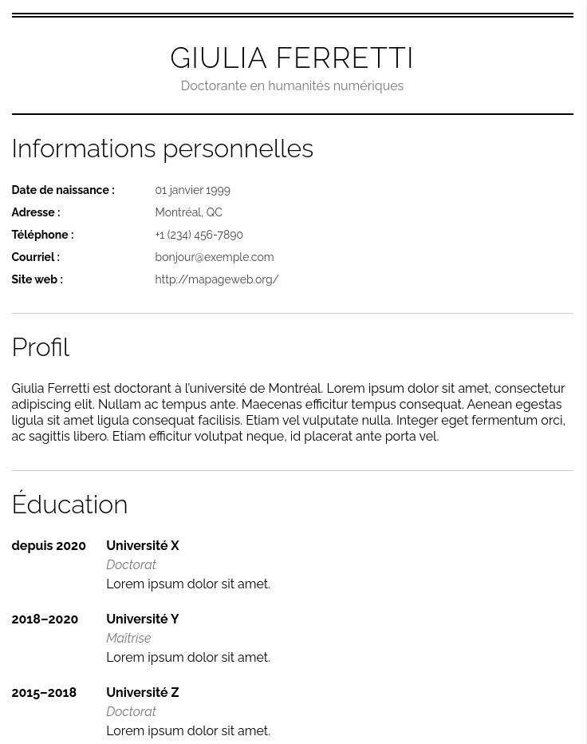

# Atelier CSS – Construire un CV

L’atelier comporte trois grandes étapes:

1. Structuration du HTML.
2. Création d’une feuille de style CSS pour produire une disposition plus agréable.
3. Ajout de styles cosmétiques (couleur de fond, police de caractères).

Le résultat final ressemble à ceci:

N’oubliez pas de vous amuser et de vous référer à la [documentation en ligne](https://developer.mozilla.org/fr/docs/Web/CSS)!

Cette atelier à été réalisé en collaboration avec Louis-Olivier Brassard